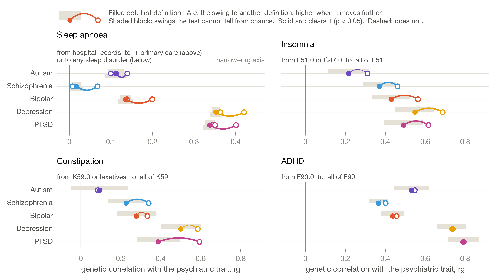
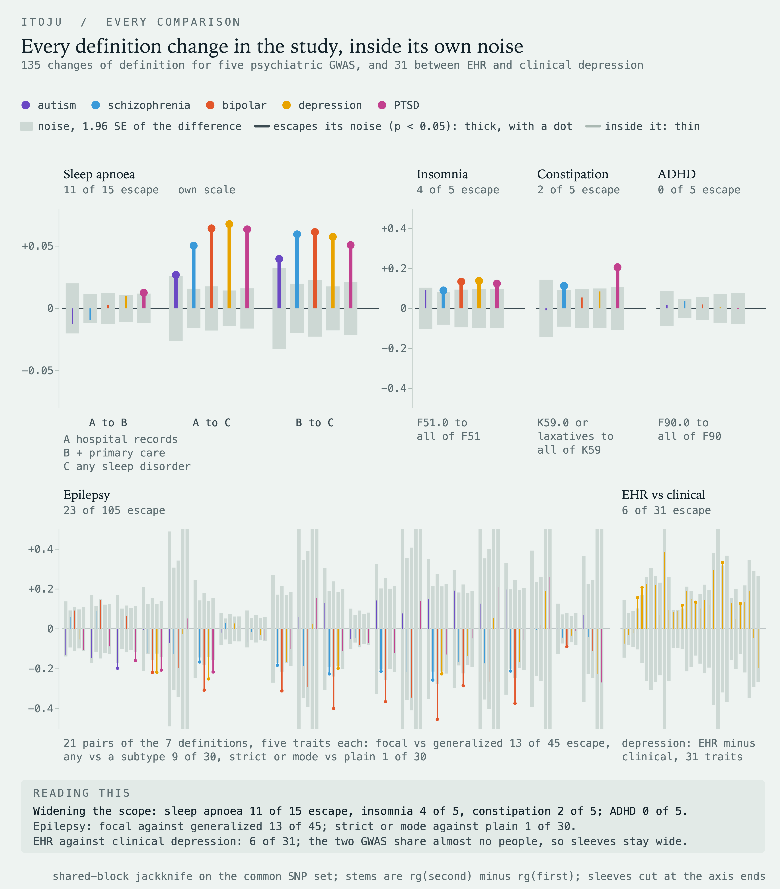
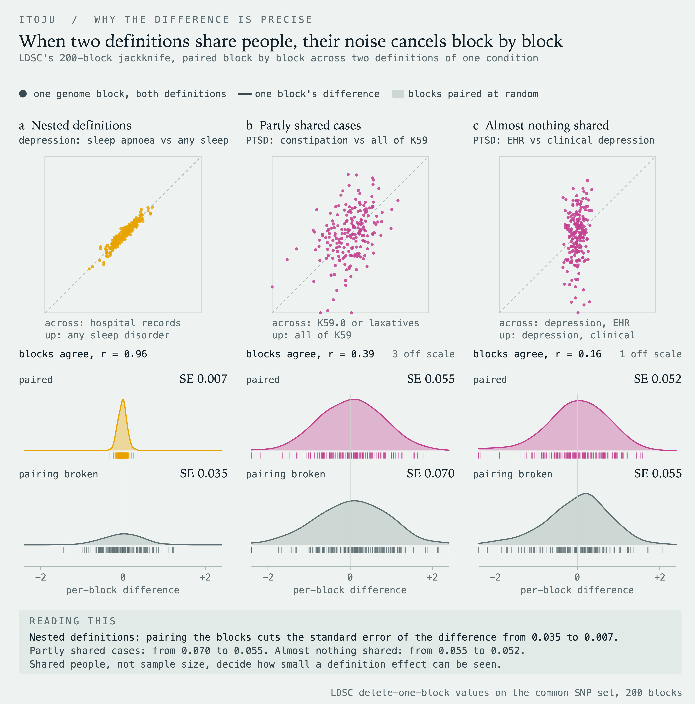
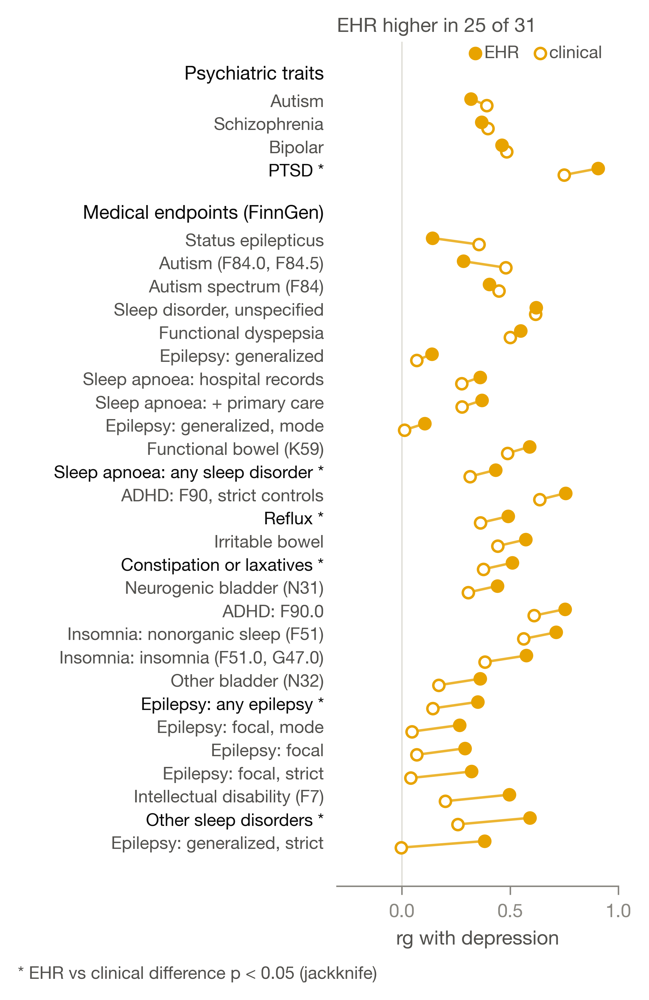
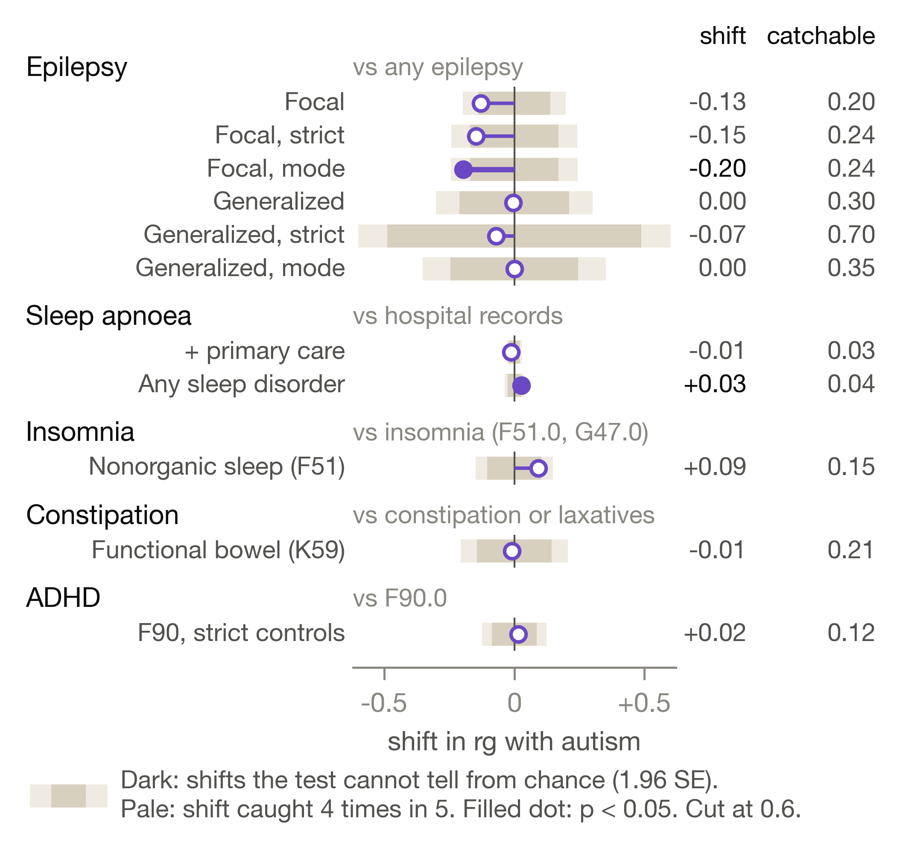
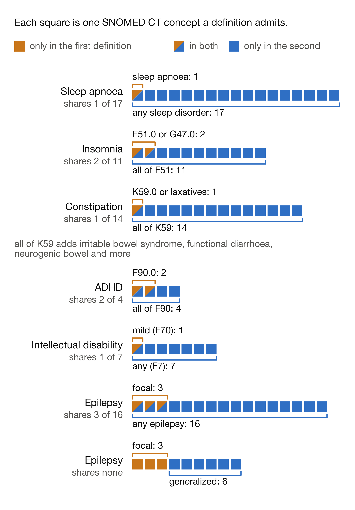

# itoju

How much the genetics of a medical condition moves when only its definition in the health record changes.

FinnGen publishes several definitions of the same condition side by side, each with its own GWAS. I took 28 of them (seven for epilepsy, three for sleep apnoea, two each for insomnia, constipation, ADHD and intellectual disability, and ten neighbouring conditions), estimated **217 genetic correlations** with autism, schizophrenia, bipolar disorder, depression and PTSD, and built a test for whether two definitions of one condition give a different answer.

**9 of 135** comparisons survive Bonferroni correction. Widening sleep apnoea to any sleep disorder raises the genetic correlation with every large psychiatric GWAS by **0.05 to 0.07**. Adding primary care records to the same definition moves it by **0.013 at most**, when the test could see a shift of 0.015. For autism, no definition effect survives correction.



*Itọ́jú* is Yoruba for care.

## The result in one table

Shift in genetic correlation when the definition changes (second definition minus first). **Bold**: survives Bonferroni (p < 0.00037). \*: p < 0.05.

| definition change | autism | schizophrenia | bipolar | depression | PTSD |
|---|---|---|---|---|---|
| sleep apnoea, hospital records to + primary care | -0.013 | -0.009 | +0.003 | +0.010 | +0.013\* |
| sleep apnoea, hospital records to any sleep disorder | +0.027\* | **+0.050** | **+0.064** | **+0.068** | **+0.063** |
| sleep apnoea + primary care to any sleep disorder | +0.040\* | **+0.059** | **+0.061** | **+0.057** | **+0.051** |
| insomnia (F51.0, G47.0) to all of F51 | +0.093 | +0.090\* | +0.134\* | +0.139\* | +0.125\* |
| constipation or laxatives to all of K59 | -0.010 | +0.113\* | +0.055 | +0.085 | **+0.207** |
| ADHD, F90.0 to all of F90 | +0.016 | +0.036 | +0.020 | +0.005 | -0.003 |

The pattern is scope, not source. Every change that pulls in related diagnoses (insomnia and narcolepsy into sleep apnoea, parasomnias into insomnia, irritable bowel syndrome into constipation) raises the correlation. Changes to where the records come from, or to how strict the rules are, do not. Across the seven epilepsy definitions the correlation differs for depression (Q = 21.0, df 6, p = 0.002), PTSD (p = 0.003) and bipolar disorder (p = 0.012), and the differences run between focal and generalized epilepsy, not between the strict, mode and plain versions of either.



## Why a difference between two correlations can be this precise

Two definitions of the same condition share most of their cases, so their genetic correlations are not independent estimates. Treating them as if they were throws away most of the precision.

LD score regression estimates its standard errors with a jackknife over 200 blocks of the genome. I restricted all 35 traits to one common set of **953,474 SNPs** and re-estimated every pair with evenly spaced blocks, so block k is the same stretch of genome in every analysis. The pseudovalue of the genetic correlation in block k is

    r_k = n * rg - (n - 1) * gencov_(k) / sqrt(h2_1,(k) * h2_2,(k)),    n = 200

and the standard error of the difference between two definitions is the standard deviation of the per-block differences over sqrt(n), which carries the correlation between the two estimates. For depression with sleep apnoea against any sleep disorder, the standard error of the difference is **0.007**. Break the pairing between blocks, as if the two estimates shared no people, and it is **0.035**.



Before trusting any of it, I checked that the rebuilt standard error of every single estimate matches the one LDSC prints itself: **198 of 198**.

## The positive control

Depression has two PGC GWAS that differ only in how cases were defined: from health records, and by clinical assessment. The known result is that the looser definition carries less specific genetics, so the method should see a definition effect there.

It does. The two correlate at **0.857** (SE 0.045) rather than 1. Clinically defined depression has twice the heritability (0.114, SE 0.012, against 0.057, SE 0.002). And EHR-defined depression gives the higher genetic correlation with **25 of 31** other traits and endpoints. Only 6 of those differences reach p < 0.05 and none survives correction, because the two GWAS share almost no samples, so their errors do not cancel. Measuring both definitions on the same people is what makes the within-FinnGen comparisons precise.



## Autism

For autism the answer is steady. No definition effect survives correction.

- **Constipation.** The genetic correlation is 0.11 under the narrow definition and 0.12 under all functional bowel disorders. The test could have seen a shift of 0.21.
- **Sleep apnoea.** Widening to any sleep disorder shifts it by 0.027 (p = 0.042), in the same direction as every other trait, with a detectable shift of 0.03 to 0.05.
- **Epilepsy.** The correlation is below zero under every definition (-0.19 to -0.02), and the smallest detectable shift is 0.11 to 0.81. These data cannot say more.



## What SNOMED CT caught

Every definition is translated to SNOMED CT through the OMOP standard vocabularies from Athena: **153 of 153** ICD-10 codes map, to 99 distinct concepts. 16 of the 28 definitions also carry ICD-8 rules, which have no OMOP vocabulary.

The mapping caught a mistake in my own labelling. I had been treating one FinnGen endpoint as a diagnosis-only definition of constipation. It maps to **14 SNOMED CT concepts**, including irritable bowel syndrome, functional diarrhoea and neurogenic bowel. It is all functional intestinal disorders, and I relabelled and reinterpreted it everywhere. Distance in SNOMED CT also tracks how far a correlation moves (Spearman 0.49) much better than the distance I fixed in advance from codes, data sources and rules (0.13), though that second finding is exploratory.



## Checks before the results

- **Published numbers reproduced.** Autism SNP heritability 0.117 (SE 0.010) against 0.118 in Grove et al. 2019; autism and ADHD genetic correlation 0.346 (SE 0.051) against 0.360.
- **Allele coding.** Every psychiatric GWAS's effect-allele frequency correlates 0.991 to 0.998 with the 1000 Genomes European frequency of the same allele.
- **Sample overlap lands in the intercept.** Median cross-trait intercept 0.001 to 0.004 for the GWAS with no FinnGen samples, 0.012 for PTSD and 0.020 for both depression GWAS, which include FinnGen.
- **Finnish linkage disequilibrium.** LD scores rebuilt from the FinnGen R12 LD matrix correlate 0.970 with the European reference across 33,436 SNPs on chromosomes 21 and 22 (median ratio 1.009).

## The animation


The one idea the rest depends on: in LD score regression the average product of two studies' z-scores rises with a SNP's LD score, the slope carries the shared genetics, and the intercept carries the people who are in both studies. The video is [figures/itoju_ldsc.mp4](figures/itoju_ldsc.mp4).

## Honest limits

- **Summary statistics only.** The number of people two definitions share is not known directly. The jackknife captures its effect on the estimates, not the counts.
- **Some pairs differ in two ways at once.** The insomnia pair differs in scope and in its control rule; the constipation pair in its laxative rule and in scope. This design cannot say which one does the work.
- **European LD reference for a Finnish cohort.** The Finnish check covers two chromosomes, not the genome.
- **The autism GWAS is the smallest of the five**, and several autism comparisons need larger samples to resolve.
- **One-step jackknife estimator.** The difference test uses LDSC's one-step estimator so the blocks line up; its standard errors are a median 8% to 16% larger than the standard two-step ones, which makes the test conservative.
- **European ancestry only.** None of these results can be assumed to hold in other populations.

## Running it

```bash
pip install -r requirements.txt

# LD score regression runs in its own environment, one level above the repository
git clone https://github.com/CBIIT/ldsc ../tools/cbiit_ldsc        # commit 1f09cf0
python3 -m venv ../tools/ldsc_env
../tools/ldsc_env/bin/pip install numpy==1.26.4 pandas==1.5.3 scipy==1.11.4 bitarray==3.11.0
```

Inputs, all public, go under `data/` (not included): the FinnGen R12 manifest and endpoint definition file, the PGC and iPSYCH-PGC summary statistics (file names in [src/03_ldsc.py](src/03_ldsc.py) and [src/04_prep_pgc.py](src/04_prep_pgc.py)), the European LD scores from Zenodo 8182036, the phecodeX WHO map, and an Athena vocabulary download.

```bash
bash src/run_munge_batch.sh                  # 28 FinnGen endpoints, streamed and never stored, resumable
python src/02_definition_anatomy.py          # definitions into codes, sources and rules
python src/04_prep_pgc.py SCZ BIP MDD PTSD MDD_EHR MDD_Clin
python src/03_ldsc.py                        # heritability and 217 genetic correlations
python src/07_definition_effect.py           # common SNP set, difference test, heterogeneity
python src/06_finnish_ldscores.py 21 22      # Finnish LD scores from the FinnGen LD matrix
bash src/08a_extract_omop.sh /path/to/athena # vocabulary slices; SNOMED CT content stays local
python src/08b_omop_mapping.py
for f in src/fig*.py; do python "$f"; done   # every figure, saved through automatic layout checks
python src/test_viz_checks.py                # tests for the layout checks themselves
python src/verify_refs.py paper/references.bib paper/itoju.tex   # every reference against Crossref
```

The published result tables carry SNOMED CT concept IDs only, never concept content, which Athena licenses.

## Layout

- [src/01_fetch_munge_finngen.py](src/01_fetch_munge_finngen.py) streams a FinnGen file, keeps HapMap3 SNPs, munges for LDSC
- [src/02_definition_anatomy.py](src/02_definition_anatomy.py) takes FinnGen endpoint rules apart: code patterns, inclusion chains, exclusion and control rules
- [src/03_ldsc.py](src/03_ldsc.py) heritability and genetic correlations
- [src/04_prep_pgc.py](src/04_prep_pgc.py) psychiatric GWAS preparation and allele-frequency checks
- [src/07_definition_effect.py](src/07_definition_effect.py) and [src/05_delta_rg.py](src/05_delta_rg.py) the shared-block jackknife difference test, Cochran's Q and the smallest detectable shift
- [src/06_finnish_ldscores.py](src/06_finnish_ldscores.py) LD scores from the FinnGen LD matrix
- [src/08a_extract_omop.sh](src/08a_extract_omop.sh) and [src/08b_omop_mapping.py](src/08b_omop_mapping.py) ICD-10 to SNOMED CT, ATC to RxNorm, hierarchy-aware overlap
- [src/fig*.py](src/) and [src/viz_style.py](src/viz_style.py) the figures and the layout checks every figure passes
- [results/](results/) every table the figures and the paper read
- [animation/](animation/) the Manim scene and the script that exports its numbers
- [paper/itoju.pdf](paper/itoju.pdf) the full write-up, IEEE format, 40 references checked against Crossref

## Papers

- Bulik-Sullivan et al. (2015), *LD Score regression distinguishes confounding from polygenicity in genome-wide association studies*, Nature Genetics. [doi:10.1038/ng.3211](https://doi.org/10.1038/ng.3211)
- Bulik-Sullivan et al. (2015), *An atlas of genetic correlations across human diseases and traits*, Nature Genetics. [doi:10.1038/ng.3406](https://doi.org/10.1038/ng.3406)
- Cai et al. (2020), *Minimal phenotyping yields genome-wide association signals of low specificity for major depression*, Nature Genetics. The known definition effect used as the positive control. [doi:10.1038/s41588-020-0594-5](https://doi.org/10.1038/s41588-020-0594-5)
- Grove et al. (2019), *Identification of common genetic risk variants for autism spectrum disorder*, Nature Genetics. [doi:10.1038/s41588-019-0344-8](https://doi.org/10.1038/s41588-019-0344-8)
- Kurki et al. (2023), *FinnGen provides genetic insights from a well-phenotyped isolated population*, Nature. [doi:10.1038/s41586-022-05473-8](https://doi.org/10.1038/s41586-022-05473-8)
- Adams et al. (2025), *Trans-ancestry genome-wide study of depression identifies 697 associations implicating cell types and pharmacotherapies*, Cell. [doi:10.1016/j.cell.2024.12.002](https://doi.org/10.1016/j.cell.2024.12.002)
- Hripcsak et al. (2015), *Observational Health Data Sciences and Informatics (OHDSI): Opportunities for Observational Researchers*, Studies in Health Technology and Informatics. [doi:10.3233/978-1-61499-564-7-574](https://doi.org/10.3233/978-1-61499-564-7-574)
