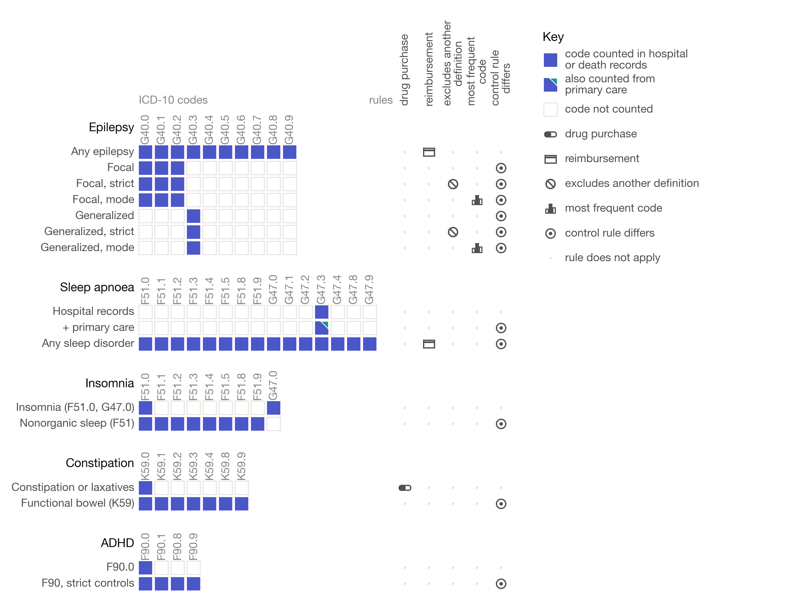
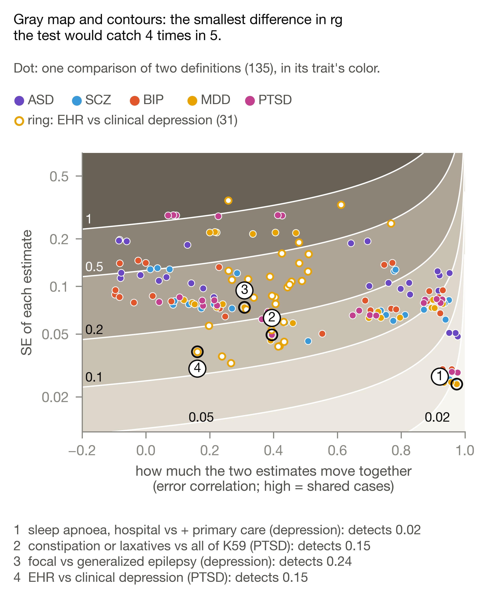
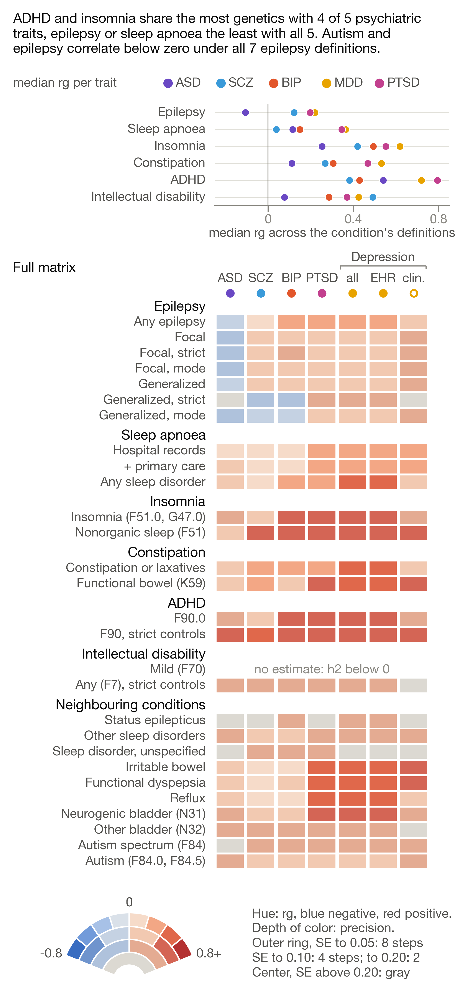

# itoju

**The Phenotype Definition Problem: How EHR Case Definitions Change the Genetic Overlap Between Autism and Its Co-occurring Medical Conditions**

*Itọ́jú* is Yoruba for care.

## Why I built this

My twin brother Taiwo has severe autism. Growing up in our village in southwestern Nigeria, nobody had words for what he was going through, and the parts of his life that took the most care were never the ones people talked about: the bathroom, constipation, the nights he did not sleep. Years later, working with data at Nigeria's Federal Ministry of Health and then in the autism program at Boston Medical Center, I kept running into the same quiet problem from the other side. When a chart says "constipation" or "epilepsy," it means whatever the rule behind that word says it means, and different rules pick up different people.

That matters for genetics. A lot of what we now claim about the biology shared between autism and its co-occurring conditions comes from biobanks and health records, where a condition is a set of codes. So I wanted to know something simple: if you keep everything else fixed and only change how a condition is defined in the record, does the genetic overlap with autism change? And if it does, by how much?

As far as I could find (PubMed, September 2026), nobody had asked that for autism's co-occurring medical conditions.

## What I did

FinnGen, the Finnish biobank of about 500,000 people, publishes several definitions of the same condition side by side, each with its own summary statistics. That makes it a natural experiment.

- **28 definitions** from FinnGen R12: seven for epilepsy, three for sleep apnoea, two each for insomnia, constipation, ADHD and intellectual disability, plus ten neighbouring conditions.
- **Five psychiatric GWAS**: autism (the focus, 18,381 cases), schizophrenia, bipolar disorder, depression and PTSD, plus depression defined from EHRs versus clinical assessment as a positive control.
- **LD score regression** for heritability and 217 genetic correlations, after checking that my pipeline reproduces the published autism numbers (heritability 0.117 against 0.118; autism and ADHD 0.346 against 0.360).
- **A difference test** for two genetic correlations that share a trait. This was the part I had to think hardest about. Two definitions of the same condition share most of their cases, so their estimates are not independent, and treating them as if they were would hide real effects. I restricted every trait to the same 953,474 SNPs so LD score regression cuts the genome into identical blocks, then differenced the per-block jackknife values. The standard error of the difference then carries the correlation between the two estimates. For sleep apnoea it fell from 0.035 to 0.007.
- **OMOP mapping**: every definition translated to SNOMED CT through the Athena vocabularies, so definitions can be compared by what they mean clinically, not just by which codes they list.

## What I found

**Scope moves the genetics. Source and strictness mostly don't.** Adding primary care records to sleep apnoea added almost 6,000 cases and moved the genetic correlation by 0.013 at most, when the test could see shifts as small as 0.015. Strict and mode versions of epilepsy agreed with their plain versions. But widening sleep apnoea to any sleep disorder raised the genetic correlation with every psychiatric trait, and widening insomnia to all nonorganic sleep disorders raised it for all five.

**For autism, the answer was steady.** No definition effect survived correction. Constipation gave the same genetic correlation with autism under both definitions (0.11 and 0.12), and the test could have seen a shift of 0.21. Epilepsy was different: autism's correlation with it was near zero under every definition, and the data are too thin there to say more.

**The best way to see a definition effect is to measure both definitions on the same people.** The precision of a difference depends far more on how much the two definitions share than on sample size.

**Mapping to SNOMED CT caught my own mistake.** I had been treating one FinnGen endpoint as "constipation, diagnosis only." When I mapped its codes to SNOMED CT, it turned out to contain irritable bowel syndrome, functional diarrhoea, neurogenic bowel and post-surgical conditions. It is really "all functional intestinal disorders." I relabelled it everywhere and rewrote the interpretation. I'm glad the mapping was in the pipeline, because the codes alone looked fine. Distance in SNOMED CT also tracked how far a genetic correlation moved (Spearman 0.49) much better than overlap in codes and data sources did (0.13).

## The animation

The GIF at the top shows the one idea everything here rests on. In LD score regression, the average product of two studies' z-scores rises with a SNP's LD score. The slope carries the shared genetics, and the intercept carries the people who are in both studies. Autism with FinnGen constipation sits on zero, because no one is in both. EHR depression with the same endpoint lifts off zero, because FinnGen participants are inside the depression GWAS. Every number on screen comes from this analysis. The full video is `figures/itoju_ldsc.mp4`.

## Honest limits

- These are public summary statistics, so I cannot count how many people two definitions share. The jackknife captures its effect, not the counts.
- Some definition pairs differ in two ways at once (insomnia in scope and control rule, constipation in its laxative rule and scope), and this design cannot say which one does the work.
- FinnGen is Finnish and the LD reference is European. On chromosomes 21 and 22, Finnish LD scores built from FinnGen's own LD matrix correlated 0.970 with the reference, but I did not rebuild a genome-wide Finnish reference.
- The autism GWAS is the smallest of the five, and several autism comparisons need bigger samples.

## Repository

| Path | What it does |
|---|---|
| `src/01_fetch_munge_finngen.py` | streams FinnGen R12 files, keeps HapMap3 SNPs, never stores the raw file |
| `src/02_definition_anatomy.py` | takes FinnGen endpoint definitions apart into codes, sources and rules |
| `src/03_ldsc.py` | heritability and genetic correlations with LD score regression |
| `src/04_prep_pgc.py` | prepares the psychiatric GWAS and checks allele alignment against 1000 Genomes |
| `src/05_delta_rg.py`, `src/07_definition_effect.py` | the shared-block jackknife difference test, heterogeneity and power |
| `src/06_finnish_ldscores.py` | Finnish LD scores from the FinnGen LD matrix |
| `src/08a_extract_omop.sh`, `src/08b_omop_mapping.py` | OMOP (Athena) mapping to SNOMED CT and RxNorm |
| `src/fig*.py`, `src/viz_style.py` | every figure, each saved through automatic layout checks |
| `animation/` | the Manim scene and the script that exports its numbers |
| `paper/itoju.tex` | the paper (IEEE format) |
| `requirements.txt` | exact package versions, including the separate LDSC environment |

Data are not included. FinnGen R12 summary statistics and endpoint definitions are public from FinnGen; the psychiatric GWAS are public from the Psychiatric Genomics Consortium; the OMOP vocabularies come from Athena under their own licences. LDSC was run with the maintained Python 3 port at github.com/CBIIT/ldsc.

Kehinde (Kenny) Obidele
